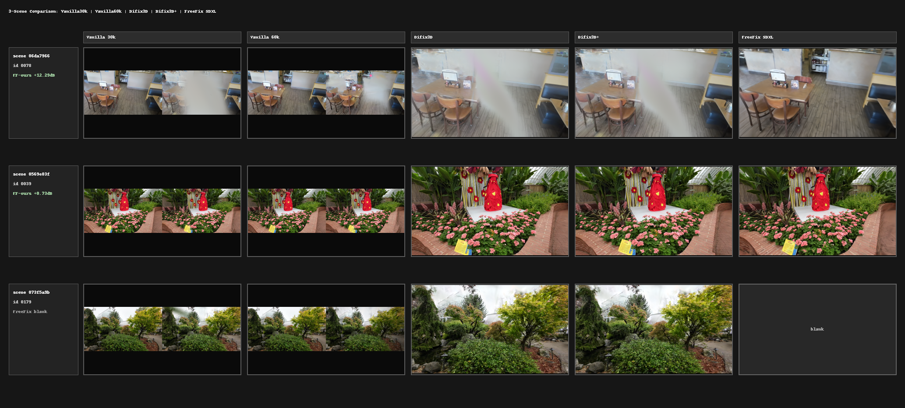

# Diffusion-IBR

Diffusion-IBR for iterative image-based refinement on top of radiance field / Gaussian Splatting training loops.

At the repository level, the main production path is:

1. Train a base 3DGS model.
2. Periodically render novel/test views.
3. Fix those views with diffusion backends (Difix3D, SDXL, or FLUX).
4. Feed fixed views back into training.
5. Evaluate with PSNR/SSIM/LPIPS.

## What Is In Scope For This README

This README focuses on the Diffusion-IBR project-owned orchestration and training code:

- `scripts/trainers/*.py`
- `scripts/priors/*.py`
- `scripts/rendering/*.py`
- `utils/*.py`
- `evaluation/evaluate_metrics.py`
- `data/DL3DV-10K-Benchmark/download.py`


Third-party vendored/cached Python code (especially huge trees in `cache_weights/` ) is treated as dependency/runtime payload, not the primary maintained surface.

## Repository Layout

- `scripts/trainers/trainer.py`: core standalone 3DGS trainer with `vanilla`, `freefix`, and `difix3d` recipes.
- `scripts/trainers/freefix_runner.py`: self-contained FreeFix-style recon/refine/eval orchestrator built on `trainer.py`.
- `scripts/trainers/nerfacto_vanilla_trainer.py`: standalone Nerfacto baseline trainer.
- `scripts/priors/fixer.py`: unified diffusion fixer entrypoint (`difix`, `sdxl`, `flux`).
- `scripts/priors/difix.py`: DifixPipeline wrapper.
- `scripts/priors/sdxl.py`, `scripts/priors/flux.py`: SDXL/FLUX img2img wrappers with mask+warp blending.
- `scripts/rendering/3dgs_render.py`: standalone splatfacto train/render helper.
- `scripts/rendering/nerfactor_render.py`: nerfacto train/render helper.
- `utils/data_colmap.py`, `utils/data_dataset.py`: COLMAP parsing, splits, dataset batches.
- `utils/freefix_support.py`: partition + YAML asset generation for FreeFix workflows.
- `evaluation/evaluate_metrics.py`: PSNR/SSIM/LPIPS image-folder evaluator.
- `configs/*.json`: preset configs for Difix3D/Difix3D+/FreeFix runners.
- `execution_scripts/*`: shell wrappers for common official/ours experiments.

## Environment Setup

```bash
cd /mntdatalora/src/Diffusion-IBR
python -m pip install -r requirements.txt
```

Notes:

- `requirements.txt` installs the self-contained stack (PyTorch, gsplat, diffusers ecosystem, pycolmap).
- Nerfstudio and some official stacks are optional and may require separate setup.
- Caches default to `cache_weights/` (HF cache variables are set by helper code if not provided).

## Data Setup (DL3DV)

Expected default root:

- `/mntdatalora/src/Diffusion-IBR/data/DL3DV-10K-Benchmark`

Download helper:

```bash
python data/DL3DV-10K-Benchmark/download.py \
  --subset hash \
  --hash <scene_hash> \
  --odir /mntdatalora/src/Diffusion-IBR/data/DL3DV-10K-Benchmark
```

For training scripts, a scene usually resolves to:

- `<dl3dv_root>/<scene_id>/gaussian_splat`

with COLMAP artifacts and images inside.

## Main Training Workflows

### 1) Vanilla 3DGS (Standalone)

```bash
python scripts/trainers/trainer.py \
  --data_dir /path/to/scene/gaussian_splat \
  --result_dir /path/to/output \
  --training_recipe vanilla \
  --max_steps 30000 \
  --eval_steps 7000,30000 \
  --save_steps 7000,30000
```

### 2) Difix3D / Difix3D+ Style Training

Preset:

- `configs/difix3d_train.json`
- `configs/difix3d_plus_train.json`

Example:

```bash
python scripts/trainers/trainer.py \
  --config configs/difix3d_plus_train.json \
  --data_dir /path/to/scene/gaussian_splat \
  --result_dir /path/to/output
```

### 3) Self-Contained FreeFix Pipeline

Preset:

- `configs/freefix_self_sdxl.json`
- `configs/freefix_self_flux.json`

Full pipeline (recon + refine + eval):

```bash
python scripts/trainers/freefix_runner.py \
  --config configs/freefix_self_flux.json
```

Stages:

- `--stage recon`
- `--stage refine`
- `--stage eval`
- `--stage full`

### 4) FreeFix Runner (Direct Scene Args)

Example:

```bash
python scripts/trainers/freefix_runner.py \
  --scene_id <scene_hash> \
  --backend flux \
  --stage full
```

### 5) Nerfacto Baseline

```bash
python scripts/trainers/nerfacto_vanilla_trainer.py \
  --scene_id <scene_hash> \
  --dl3dv_root /mntdatalora/src/Diffusion-IBR/data/DL3DV-10K-Benchmark \
  --output_dir /mntdatalora/src/Diffusion-IBR/outputs \
  --max_num_iterations 30000
```

## Diffusion Fixer Backends

Unified wrapper: `scripts/priors/fixer.py`

- `difix`: `CustomDifixFixer` via `works/Difix3D/src/pipeline_difix.py`
- `sdxl`: `CustomSDXLFixer`
- `flux`: `CustomFluxFixer`

Quick single-image CLI:

```bash
python scripts/priors/fixer.py \
  --backend difix \
  --input_image in.png \
  --ref_image ref.png \
  --output_image out.png \
  --prompt "remove degradation" \
  --steps 1 \
  --timestep 199 \
  --guidance_scale 0.0
```

## Rendering Helpers

### Splatfacto baseline helper

```bash
python scripts/rendering/3dgs_render.py \
  --mode train_and_render \
  --data_dir /path/to/nerfstudio_data \
  --output_dir /path/to/output \
  --experiment_name scene_name
```

### Nerfacto helper

```bash
python scripts/rendering/nerfactor_render.py \
  --mode train_and_render \
  --data_dir /path/to/nerfstudio_data \
  --output_dir /path/to/output \
  --experiment_name scene_name
```

## Evaluation

```bash
python evaluation/evaluate_metrics.py \
  --pred-dir /path/to/pred \
  --gt-dir /path/to/gt \
  --recursive \
  --json-out /path/to/report.json
```

Supports:

- relative-path pairing (default)
- filename fallback pairing
- optional resizing (`--allow-resize`)
- LPIPS backbone choice (`alex` or `vgg`)

## Output Structure (Typical)

`trainer.py` writes:

- `result_dir/cfg.json`
- `result_dir/ckpts/ckpt_<step>_rank0.pt`
- `result_dir/stats/train_step<step>.json`
- `result_dir/stats/eval_step<step>.json`
- `result_dir/renders/eval_<step>/*_pred.png,*_gt.png`
- `result_dir/renders/novel/<step>/Pred|Ref|Fixed|Alpha|Mask/...` (when fixer runs)

## Results

### Qualitative 3-Scene Comparison



### `tab:main_fourway_results`

Higher PSNR/SSIM is better. Lower LPIPS is better. Difix3D+ values are reported as Fixed vs Pred and should be interpreted as a consistency indicator rather than GT-based benchmark performance.

| Scene ID | Vanilla 3DGS (30k) PSNR ↑ | Vanilla 3DGS (30k) SSIM ↑ | Vanilla 3DGS (30k) LPIPS ↓ | Vanilla 3DGS (60k) PSNR ↑ | Vanilla 3DGS (60k) SSIM ↑ | Vanilla 3DGS (60k) LPIPS ↓ | Difix3D (30k→60k) PSNR ↑ | Difix3D (30k→60k) SSIM ↑ | Difix3D (30k→60k) LPIPS ↓ | Difix3D+ (post fix) PSNR ↑ | Difix3D+ (post fix) SSIM ↑ | Difix3D+ (post fix) LPIPS ↓ |
|---|---:|---:|---:|---:|---:|---:|---:|---:|---:|---:|---:|---:|
| 032dee9f | 24.0766 | 0.8501 | 0.1308 | 24.3810 | 0.8460 | 0.1315 | 25.8726 | 0.8673 | 0.1059 | 27.4275 | 0.8964 | 0.1063 |
| 0569e83f | 25.1954 | 0.8227 | 0.0699 | 24.7916 | 0.8100 | 0.0760 | 25.4569 | 0.8274 | 0.0671 | 27.3584 | 0.8845 | 0.0591 |
| 06da7966 | 20.7274 | 0.7523 | 0.2285 | 20.4621 | 0.7320 | 0.2593 | 21.8935 | 0.7779 | 0.1897 | 27.6048 | 0.9096 | 0.1279 |
| 073f5a9b | 19.0835 | 0.5367 | 0.2593 | 18.9492 | 0.5228 | 0.2498 | 19.3105 | 0.5414 | 0.2513 | 24.0638 | 0.7999 | 0.1815 |
| 07d9f972 | 35.5538 | 0.9736 | 0.0168 | 35.4822 | 0.9729 | 0.0172 | 36.1725 | 0.9751 | 0.0155 | 33.0893 | 0.9581 | 0.0284 |
| 08539793 | 31.5481 | 0.9408 | 0.0554 | 31.6862 | 0.9396 | 0.0534 | 32.2981 | 0.9441 | 0.0523 | 31.9979 | 0.9491 | 0.0518 |
| Average | 26.0308 | 0.8127 | 0.1268 | 25.9587 | 0.8031 | 0.1312 | 26.8340 | 0.8222 | 0.1136 | 28.5903 | 0.8996 | 0.0925 |


### `tab:loss_gs_only`

Training loss progression for vanilla 3DGS and Difix3D across six scenes, with Gaussian counts at vanilla 30k, vanilla 60k, and final Difix stage.

| Scene ID | Vanilla Loss @ 3k | Vanilla Final loss @ 29.9k | Difix Loss @ 30k | Difix Final loss @ end | Vanilla 30k #GS | Vanilla 60k #GS | Difix #GS |
|---|---:|---:|---:|---:|---:|---:|---:|
| 032dee9f | 0.032596 | 0.017091 | 0.024939 | 0.020202 | 1,750,290 | 1,823,396 | 1,750,290 |
| 0569e83f | 0.064647 | 0.019289 | 0.020930 | 0.012679 | 2,955,341 | 3,653,757 | 2,955,341 |
| 06da7966 | 0.042576 | 0.007296 | 0.018449 | 0.009811 | 1,801,841 | 2,180,257 | 1,801,841 |
| 073f5a9b | 0.118315 | 0.045935 | 0.053471 | 0.023371 | 882,078 | 1,098,075 | 882,078 |
| 07d9f972 | 0.018369 | 0.009074 | 0.011908 | 0.010982 | 313,307 | 331,116 | 313,307 |
| 08539793 | 0.032414 | 0.013004 | 0.021408 | 0.013637 | 850,247 | 1,008,045 | 850,247 |


### `tab:main_reduced_results`

Per-scene comparison across vanilla 3DGS baselines, Difix3D+ post-fix outputs, and an illustrative FreeFix column. Higher PSNR/SSIM is better, lower LPIPS is better.

| Scene ID | Vanilla 3DGS (30k) PSNR ↑ | Vanilla 3DGS (30k) SSIM ↑ | Vanilla 3DGS (30k) LPIPS ↓ | Vanilla 3DGS (60k) PSNR ↑ | Vanilla 3DGS (60k) SSIM ↑ | Vanilla 3DGS (60k) LPIPS ↓ | Difix3D+ (post-fix) PSNR ↑ | Difix3D+ (post-fix) SSIM ↑ | Difix3D+ (post-fix) LPIPS ↓ | FreeFix PSNR ↑ | FreeFix SSIM ↑ | FreeFix LPIPS ↓ |
|---|---:|---:|---:|---:|---:|---:|---:|---:|---:|---:|---:|---:|
| 0569e83f | 25.1954 | 0.8227 | 0.0699 | 24.7916 | 0.8100 | 0.0760 | 27.3584 | 0.8845 | 0.0591 | 27.5200 | 0.8890 | 0.0560 |
| 06da7966 | 20.7274 | 0.7523 | 0.2285 | 20.4621 | 0.7320 | 0.2593 | 27.6048 | 0.9096 | 0.1279 | 27.7800 | 0.9130 | 0.1230 |
| Average | 22.9614 | 0.7875 | 0.1492 | 22.6269 | 0.7710 | 0.1677 | 27.4816 | 0.8971 | 0.0935 | 27.6500 | 0.9010 | 0.0895 |
